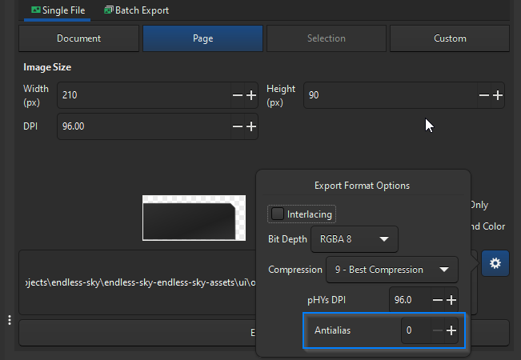
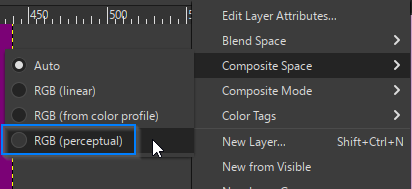

# endless-sky-assets

The official asset directory for sprites in [Endless Sky](https://github.com/endless-sky/endless-sky).

## Process for updating UI components:

1. Use Inkscape to update the .svg
2. Export to .png, _be sure to uncheck anti-aliasing_
   - Once @2x and once at original size
3. Using the appropriate .xcf file, to apply shading or other graphical effects
   - Once @2x and once at original size
4. Export to .png

## Tips and Tricks

### Inkscape
1. When exporting to .png files, be sure to turn OFF anti-aliasing:
   - 
2. Be sure to align graphics exact pixel locations to ensure crisp lines 

### GIMP
1. Most of the original .xcf files were processed and saved using GIMP 2.8, however some have been saved in later versions of GIMP, e.g. 2.10. Be aware that if you save a .xcf file with a newer version of GIMP it may not be able to be edited in an earlier version.
2. When using a later version of GIMP (2.10+) the composite space for a given layer may need to be specified to achieve appropriate color mapping:
   - 