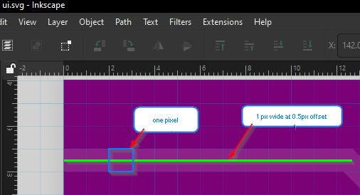
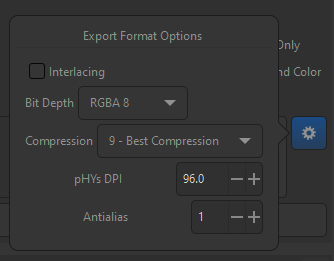

# Process for updating UI components:

1. Use Inkscape to update the .svg
2. Export to .png, be sure to configure DPI and anti-aliasing for export
3. Using the appropriate .xcf file, apply shading or other graphical effects
4. Export to .png
   - Once @2x (192 DPI) for the high dpi plugin
   - and once at original size (96 DPI) for the standard game resolution

## Tips and Tricks

### Inkscape
For most if not all UI elements there exist .svg files which can be edited in Inkscape. The base unit for these files is one pixel. 

It is important to note that elements such as rectangles are aligned from whole-pixel to whole-pixel, and they export nicely for the 1px scale. However, the line elements, which are 1px wide, must be aligned to the half-pixel because a one pixel wide line will have half a pixel on either side!

Once a .svg file has been updated as necessary, it is exported as to the .png format. It can be exported with 96 dpi for @1x and 192 dpi for @2x. The following settings work very well, pay special attention to the anti-aliasing setting (1 px). Also, there's no reason not to choose "Best" quality.
   

### GIMP
Each UI component likely also has a .xcf file or two (sometimes one per scale). If there is only the @2x file, then it is likely that you can work at 192 dpi and then rescale and export to 1x (96 dpi) at the end of the process. These files generally add shadows underneath the content that we got from the .png file.

Most of the original .xcf files were processed and saved using GIMP 2.8, however many have been saved in later versions of GIMP, e.g. 2.10.
   - Please use Gimp version 2.10.x. Previously 2.8.x was used, but most of the .xcf files are no longer backwards compatible with 2.8. For that same reason, don't use 3.x as it will affect everyone else. 

When importing the .png files, it is quite likely that you will need to adjust the setting for each layer's composite space. It seems that 2.8 and 2.10 had different defaults, and you'll notice that some .xcf files require you to adjust the Composite Space for the layer to explicitly "RGB (perceptual)" rather than "Auto". 

